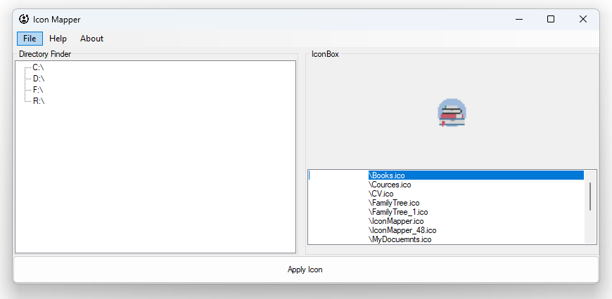

# IconMapper

[](https://github.com/blazingvx/IconMapper)


**IconMapper** is a Windows Forms application that allows users to apply custom icons to folders on their system. The application provides a user-friendly interface to select and apply icons from a specified directory to the chosen folders.



## Features

- Load and display available drives and folders in a tree view.
- Select and apply `.ico` files as icons for folders.
- Preview selected icons before applying them.
- Import multiple `.ico` files directly into the icon folder.
- Update the icon folder path through a settings menu.
- Help and about dialogs for user guidance.
- Refresh folder view to reflect icon changes immediately.

## Getting Started

### Prerequisites

- .NET Framework (version specified in the project)
- Visual Studio (for building and running the project)
- PowerShell (for executing the script to update folder icons)

### Installation

1. **Clone the Repository**

   ```bash
   git clone https://github.com/blazingvx/IconMapper.git
   cd IconMapper
    ```

2. **Configure Icon Folder Path**

    Open App.config and add the path to your .ico files. Update the IconFolderPath entry:

   ```bash
    <appSettings>
        <add key="IconFolderPath" value="C:\Path\To\Your\Icons"/>
    </appSettings>


3. **Build and Run**

    Open the project in Visual Studio and build it using the following steps:

    - Open Solution Explorer.
    - Right-click on the solution and select Build.

4. **Create Installer**

    To create a new installer for the application using Visual Studio Installer Project:

    - Right-click on your solution in Solution Explorer and choose Add > New Project.
    - Select Setup Project under the Other Project Types > Setup and Deployment category.
    - Add the main project output to the installer project.
    - Configure the installer project settings as needed (e.g., add shortcuts, custom actions).
    - Build the installer project to generate the setup file (Can be created using existing setup project).

### Future Enhancements

We plan to introduce the following features in future updates:

- Consider adding a feature for deleting icons from the icon folder.
- Explore the possibility of adding more icon formats for import.

### Change Log

For a detailed list of changes and updates, please refer to the [Change Log](./docs/ChangeLog.md).

### Reference

For a detailed blog post on how this application was developed, visit this [Medium article](https://medium.com/@vedantsoodblog/iconmapper-simplify-customizing-folder-icons-on-windows-3f03198555c7).

### License

This project is licensed under the terms of the [MIT License](LICENSE).

### Contributing

We welcome contributions to this project! If you have suggestions, bug fixes, or improvements, please follow these guidelines:

- Fork the repository and clone your fork.
- Create a new branch for your changes.
- Commit your changes with clear, descriptive messages.
- Push your changes to your fork and create a pull request.
- Please ensure your code follows the existing style and includes tests where applicable.

## Contact

For any inquiries or issues, please open an issue on the [GitHub repository](https://github.com/blazingvx/IconMapper/issues).

